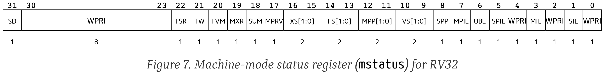

# PA1 实验报告

## 实验进度

本阶段完成了`riscv32`架构下PA1规定的所有必做任务。此外，还额外实现了修改Makefile使其支持通过`make valrgind`调用valgrind检查内存泄漏，以及表达式求值中的`||`。

在实现表达式求值时，起初未在在寻找主运算符时才区别处理负号和减号，而非在词法分析中处理，后来的解引用/乘法的区分也采用了类似方法。目前的测试表明这种做法也能正确工作，但可能逻辑较词法分析时实现更加复杂。

## 实验必答题

### 1. 程序是个状态机：计算1+2+...+100的程序的状态机

```
(PC, r1, r2)
(0, x, x) ->
(1, 0, x) ->
(2, 0, 0) ->
(3, 0, 1) ->
(4, 1, 1) ->
(2, 1, 1) ->
(3, 1, 2) ->
(4, 3, 2) ->
(2, 3, 2) ->
(3, 3, 3) ->
(4, 6, 3) ->
(2, 6, 3) ->
......    ->
(2, 4851, 98)  ->
(3, 4851, 99)  ->
(4, 4950, 99)  ->
(2, 4950, 99)  ->
(3, 4950, 100) ->
(4, 5050, 100) ->
(5, 5050, 100) ->
(5, 5050, 100) ->
(5, 5050, 100) ->
......
```

### 2. 理解基础设施：建议调试器的作用

在没有简易调试器时，需要$30 \times 20 \times (500 \times 90\%) = 270,000$s（合75h）完成调试。在有简易调试器时，相同的工作只需要$10 \times 20 \times (500 \times 90\%) = 90,000$s（合25h）完成，节省50h。

### 3. RTFM：阅读RISC-V手册

#### riscv32有哪几种指令格式?

根据非特权指令手册第2.2节，RV32I共包括R-Type、I-Type、S-Type、U-Type四种指令格式。根据第2.3节，为了更方便地处理立即数，又增加了B-Type和J-Type两种指令格式。

#### LUI指令的行为是什么?

根据非特权指令手册第2.4.1节，LUI将寄存器`rd`的高20位赋值位指令指定的立即数，将其余的12位置0。

原文：LUI (load upper immediate) is used to build 32-bit constants and uses the U-type format. LUI places the 32-bit U-immediate value into the destination register rd, filling in the lowest 12 bits with zeros.

#### mstatus寄存器的结构是怎么样的?

根据特权指令手册第3.1.6节，mstatus寄存器由以下部分构成


### 4. shell命令

通过
```shell
find . -name "*.[ch]" | xargs wc -l | grep total | awk '{ print $1 }'
```
可以获得所有.c和.h文件的总行数。目前为24770行。

通过
```shell
git diff --stat pa0 | grep changed | awk -F',' '{ print $2,$3 }' | awk '{ print $1 }'
```
可以获得当前状态相对分支`pa0`新增的行数。目前为1038行。

通过
```shell
find . -name "*.[ch]" | xargs sed '/^[\s]*$/d' | wc -l | awk '{ print $1 }'
```
可以获取除所有.c和.h文件除空行外的总的行数。目前为21532行。

### 5. RTFM

`-Wall`表示使编译器检查一些可能存在潜在问题，但又不属于error的情形，并输出warning。`-Werrors`是使编译器将所有的warning当作error来处理，使编译不通过。个人的体会是开启这两个选项有助于避免许多未定义的行为，强迫程序编写者为这些行为提供明确的定义，从而有助于写出高质量、安全的代码。
